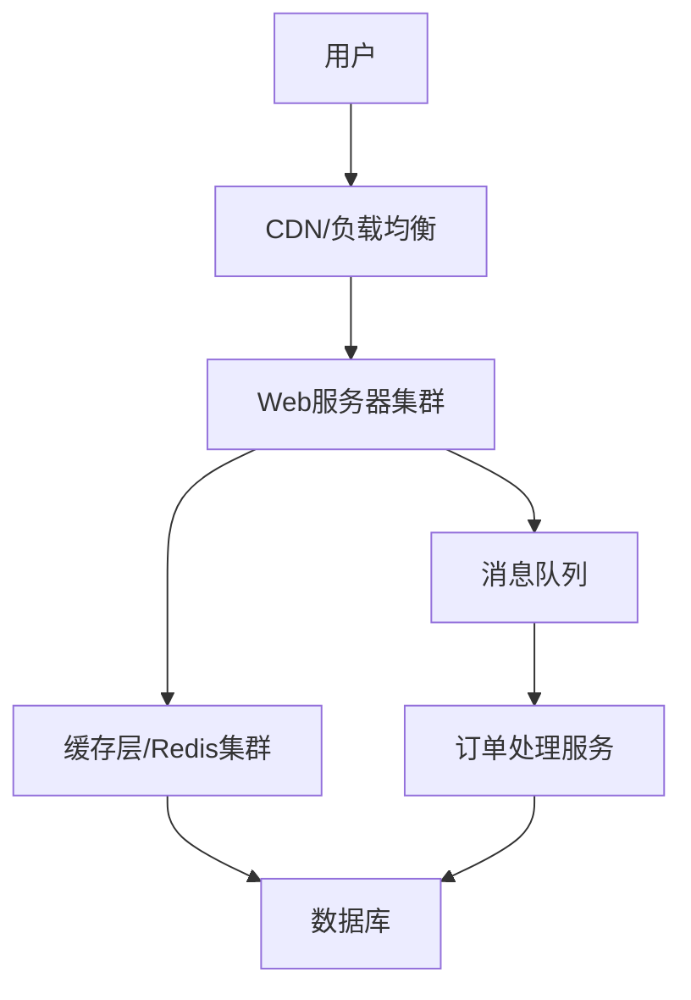
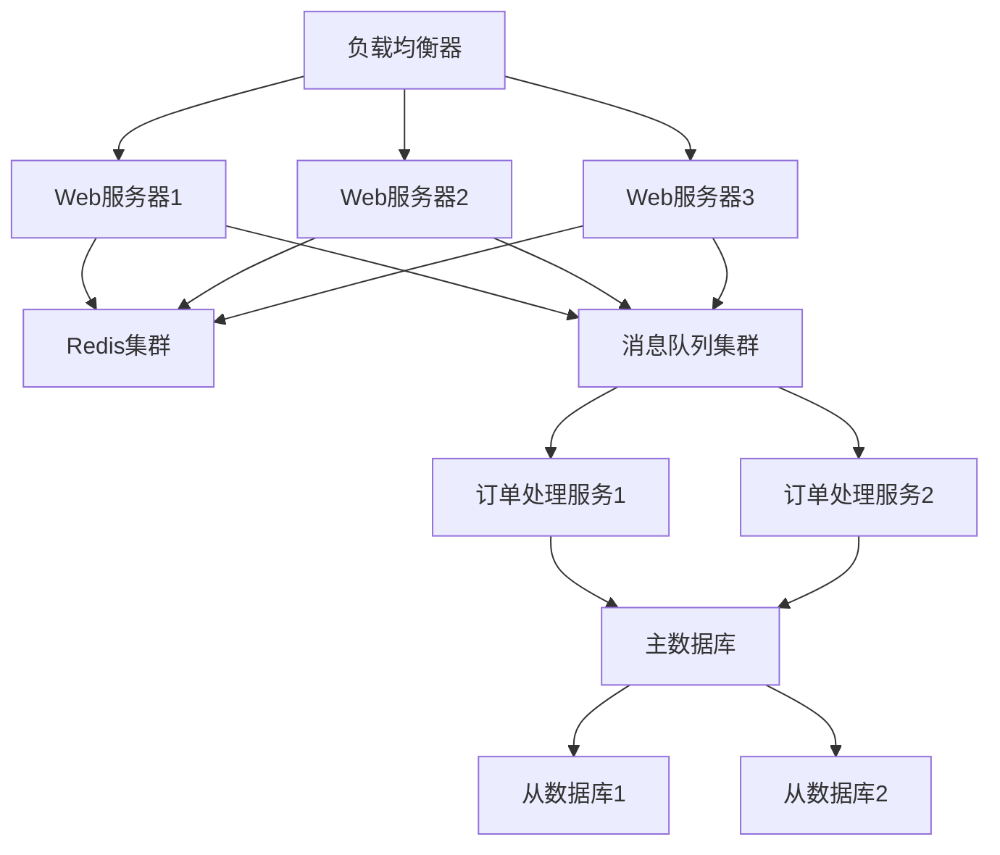

# 秒杀系统设计方案

## 1. 系统特点

- 高并发
- 瞬时流量大
- 库存有限
- 防作弊要求高

## 2. 核心设计原则

### 2.1 前端优化

- 页面静态化
- CDN加速
- 限流措施（按钮控制）
- 防重复提交

### 2.2 后端架构



### 2.3 核心技术方案

#### 缓存设计

```java
public class StockCache {
    private RedisTemplate redisTemplate;
    
    public boolean deductStock(String productId) {
        String key = "stock:" + productId;
        // 使用Redis的原子操作
        Long stock = redisTemplate.opsForValue().decrement(key);
        return stock >= 0;
    }
}
```

#### 消息队列

```java
public class OrderProcessor {
    @RabbitListener(queues = "orderQueue")
    public void process(OrderMessage message) {
        // 异步处理订单
        try {
            orderService.createOrder(message);
        } catch (Exception e) {
            // 失败重试机制
            messageQueue.retry(message);
        }
    }
}
```

## 3. 关键技术点详解

### 3.1 限流策略

- 计数器限流
- 漏桶算法
- 令牌桶算法

### 3.2 防重设计

- 全局唯一ID
- 幂等性控制
- 分布式锁

### 3.3 库存设计

1. 预扣减机制
2. 库存分片
3. 热点数据隔离

## 4. 性能优化建议

1. **缓存优化**
   - 多级缓存
   - 热点数据预加载
   - 缓存预热

2. **数据库优化**
   - 分库分表
   - 读写分离
   - 索引优化

3. **服务优化**
   - 服务降级
   - 熔断机制
   - 限流保护

## 5. 监控告警

1. 系统监控
   - QPS监控
   - 响应时间监控
   - 错误率监控

2. 业务监控
   - 下单转化率
   - 库存变化
   - 订单完成率

## 6. 具体实现示例

### 6.1 限流实现

```java
@Component
public class RateLimiter {
    @Autowired
    private RedisTemplate<String, Object> redisTemplate;
    
    public boolean tryAcquire(String key) {
        String script = "local current = redis.call('get', KEYS[1]) " +
                       "if current and tonumber(current) > 0 then " +
                       "  redis.call('decr', KEYS[1]) " +
                       "  return 1 " +
                       "end " +
                       "return 0";
        
        return redisTemplate.execute(script, Arrays.asList(key)) == 1;
    }
}
```

### 6.2 分布式锁实现

```java
public class DistributedLock {
    private RedisTemplate redisTemplate;
    
    public boolean lock(String key, String value, long expireTime) {
        return redisTemplate.opsForValue()
            .setIfAbsent(key, value, expireTime, TimeUnit.MILLISECONDS);
    }
    
    public boolean unlock(String key, String value) {
        String script = "if redis.call('get', KEYS[1]) == ARGV[1] then " +
                       "  return redis.call('del', KEYS[1]) " +
                       "else " +
                       "  return 0 " +
                       "end";
        
        return redisTemplate.execute(script, Arrays.asList(key), value) == 1;
    }
}
```

### 6.2 秒杀核心逻辑

```java
public boolean seckill(Long userId, Long productId) {
    // 1. 限流控制
    if (!rateLimiter.tryAcquire("seckill:" + productId)) {
        return false;
    }
    
    // 2. 检查库存
    String stockKey = "stock:" + productId;
    Integer stock = (Integer) redisTemplate.opsForValue().get(stockKey);
    if (stock == null || stock <= 0) {
        return false;
    }
    
    // 3. 检查重复下单
    String orderKey = "order:" + userId + ":" + productId;
    if (Boolean.TRUE.equals(redisTemplate.hasKey(orderKey))) {
        return false;
    }
    
    // 4. 预减库存
    Long remainStock = redisTemplate.opsForValue().decrement(stockKey);
    if (remainStock < 0) {
        redisTemplate.opsForValue().increment(stockKey);
        return false;
    }
    
    // 5. 发送消息到队列
    SeckillMessage message = new SeckillMessage(userId, productId);
    rabbitTemplate.convertAndSend(RabbitMQConfig.SECKILL_QUEUE, message);
    
    return true;
}
```

### 6.3 异步处理订单

```java
@RabbitListener(queues = RabbitMQConfig.SECKILL_QUEUE)
public void handleSeckillMessage(SeckillMessage message) {
    try {
        // 1. 创建订单
        Order order = createOrder(message.getUserId(), message.getProductId());
        
        // 2. 记录订单信息
        String orderKey = "order:" + message.getUserId() + ":" + message.getProductId();
        redisTemplate.opsForValue().set(orderKey, order);
        
    } catch (Exception e) {
        // 3. 异常处理：恢复库存
        String stockKey = "stock:" + message.getProductId();
        redisTemplate.opsForValue().increment(stockKey);
    }
}
```

## 7. 部署架构



## 8. 部署说明

### 8.1 环境要求
- JDK 8+
- Redis 6.0+
- RabbitMQ 3.8+
- Spring Boot 2.7.0

### 8.2 配置说明
```yaml
spring:
  redis:
    host: localhost
    port: 6379
  rabbitmq:
    host: localhost
    port: 5672
    username: guest
    password: guest
```

## 9. 注意事项

1. 系统启动前需要：
   - 确保 Redis 服务可用
   - 确保 RabbitMQ 服务可用
   - 预热商品库存到 Redis

2. 性能优化建议：
   - Redis 集群部署
   - MQ 集群部署
   - 应用服务器集群部署

3. 可靠性保证：
   - 消息队列需要开启持久化
   - Redis 需要持久化配置
   - 关键操作需要日志记录

4. 监控告警：
   - 库存监控
   - 队列堆积监控
   - 系统性能监控

## 10. 扩展建议

1. 数据持久化
   - 添加数据库支持
   - 定时同步缓存数据

2. 安全性提升
   - 添加用户认证
   - 接口签名校验
   - 防刷限制

3. 功能扩展
   - 秒杀结果查询
   - 订单支付功能
   - 库存回收机制

## 11. 参考资料

- 《高性能MySQL》
- 《Redis设计与实现》
- 《分布式系统设计原理与范式》
- 《大型网站技术架构：核心原理与案例分析》
